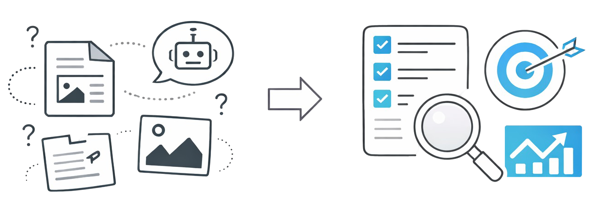

<p align="center">
  
</p>

<h1 align="center">insAIght Hub</h1>

<p align="center">
  <strong>Because understanding beats output.</strong>
</p>

<p align="center">
  Turn scattered AI output into shared understanding — structured, searchable, and easy to act on.
</p>

<p align="center">
  <a href="#why-insaight-hub">Why insAIght Hub?</a> •
  <a href="#features">Features</a> •
  <a href="#quick-start">Quick Start</a> •
  <a href="#documentation">Documentation</a>
</p>

---

## Why insAIght Hub?

AI generates a lot of output. Reports, summaries, documentation, analysis — it all piles up fast. But raw output isn't the same as understanding.

**insAIght Hub solves three problems:**

### 1. Scattered Output
AI outputs live in chat logs, documents, and shared drives. Finding that one analysis from last month? Good luck.

**insAIght Hub** gives every insight a permanent home with tags, search, and audience targeting.

### 2. Wrong Audience, Wrong Format
A technical deep-dive isn't useful to stakeholders. An executive summary doesn't help developers debug.

**insAIght Hub** lets you tag insights for specific audiences — developers, stakeholders, or end users — so people find what's relevant to them.

### 3. No Collaboration Layer
AI outputs are static. There's no way for teams to discuss, question, or build on what was generated.

**insAIght Hub** adds threaded comments so insights become conversations, not dead ends.

---

## Features

| Feature | Description |
|---------|-------------|
| **Insight Management** | Create, edit, and publish multi-file insights (HTML, CSS, JS) |
| **Audience Targeting** | Tag content for developers, stakeholders, or end users |
| **Search & Discovery** | Filter by tags, audience, or full-text search |
| **Threaded Comments** | Discuss and collaborate on published insights |
| **Real-time Updates** | Live notifications when new insights are published |
| **REST API** | Full programmatic access with token authentication |
| **MCP Server** | AI agent integration via Model Context Protocol |
| **Theme Support** | Light, dark, and corporate themes via DaisyUI |
| **Invite-Only Access** | Secure onboarding with time-limited invite tokens |

---

## Quick Start

### Requirements
- Ruby 3.4.5
- Rails 8.0.3
- Node.js

### Setup

```bash
# Clone and install
git clone <repository-url>
cd insaight_hub
bundle install
npm install

# Database
bin/rails db:create db:migrate db:seed

# Run
bin/dev
```

Open `http://localhost:3000` and log in:
- **Email:** admin@example.com
- **Password:** admin

---

## Documentation

See the [API Documentation](docs/API.md) for REST API reference and examples.

---

## Deployment

### Docker

```bash
docker build -t insaight_hub .
docker run -d -p 80:80 \
  -e RAILS_MASTER_KEY=<your-master-key> \
  -e SECRET_KEY_BASE=$(bin/rails secret) \
  insaight_hub
```

### Docker Compose

```bash
cp .env.example .env
# Edit .env with your values
docker-compose up -d
```

### Kamal

```bash
kamal setup
kamal deploy
```

---

## Development

```bash
# Run tests
bin/rails test
bin/rails test:system

# Code quality
bundle exec rubocop
bundle exec brakeman
```

---

## Contributing

1. Fork the repository
2. Create your feature branch (`git checkout -b feature/amazing-feature`)
3. Commit your changes
4. Push to the branch
5. Open a Pull Request

---

## License

[Add your license here]
